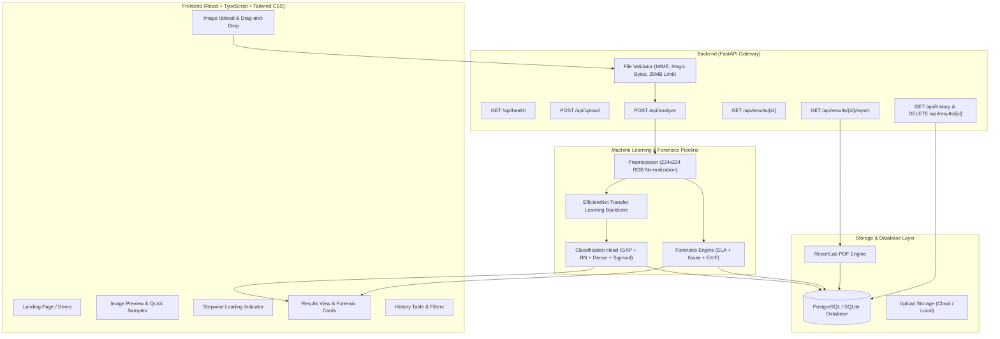

# ImageGuard: Comprehensive Architecture & Implementation Report

**Product:** ImageGuard (v3.0)  
**Type:** AI-Powered Image Authenticity & Manipulation Detection Web Application  
**Technology Stack:** React, TypeScript, Tailwind CSS, FastAPI, TensorFlow/Keras (EfficientNet), Supabase / SQLite, ReportLab  
**Date:** September 2026  

---

## Table of Contents
1. [Executive Summary](#1-executive-summary)
2. [Dataset Classification & Ingestion](#2-dataset-classification--ingestion)
3. [End-to-End System Architecture](#3-end-to-end-system-architecture)
4. [How the System Works (Data Flow)](#4-how-the-system-works-data-flow)
5. [What Has Been Built (Component Breakdown)](#5-what-has-been-built-component-breakdown)
   - [5.1 Machine Learning Pipeline](#51-machine-learning-pipeline)
   - [5.2 FastAPI Backend & Endpoints](#52-fastapi-backend--endpoints)
   - [5.3 Database & Cloud Persistence](#53-database--cloud-persistence)
   - [5.4 Frontend Web Application](#54-frontend-web-application)
6. [Automated Verification & Test Results](#6-automated-verification--test-results)
7. [How to Run and Test the Platform](#7-how-to-run-and-test-the-platform)
8. [Roadmap & Future Phases](#8-roadmap--future-phases)

---

## 1. Executive Summary

**ImageGuard** is a full-stack AI SaaS platform engineered to distinguish authentic photographs from synthetic or AI-generated media. Rather than providing an unexplained binary output, the platform pairs **deep neural pattern recognition** (EfficientNet) with **classical forensic analysis** (Error Level Analysis, high-frequency noise variance, and EXIF metadata extraction).

Users receive:
- **AI vs. Real Probability Scores** (e.g., 96.4% AI / 3.6% Real)
- **Calibrated Confidence Level** (High, Medium, Low)
- **Forensic Manipulation Indicators** (Compression ELA, Resizing, Noise/Smoothing, EXIF)
- **Scientific Interpretation & Responsible AI Disclaimers**
- **Downloadable PDF Analysis Reports** (via ReportLab)
- **Historical Search & Filter Dashboard**

---

## 2. Dataset Classification & Ingestion

The benchmark Kaggle dataset (`shivamardeshna/real-and-fake-images-dataset-for-image-forensics`) was ingested and organized using `scripts/organize_dataset.py`.

### Results Summary
- **Source:** Kaggle Image Forensics Dataset
- **Classification Method:** Deterministic ground-truth directory hierarchy parsing (no AI guessing used)
- **File Validation:** Allowed formats `.jpg`, `.jpeg`, `.png`, `.webp`; integrity verified via PIL `img.verify()` and `img.load()`.
- **Integrity Outcome:** 0 corrupted files detected; 100% loss-free ingestion.

| Category | File Count | Location | Status |
| :--- | :--- | :--- | :--- |
| **Authentic Photographs (REAL)** | **8,803** | `data/real/` | Validated & Organized |
| **AI-Generated Images (FAKE)** | **48,786** | `data/fake/` | Validated & Organized |
| **Total Images Organized** | **57,589** | `data/` | 100% Verified |
| **Corrupted Files** | **0** | `data/corrupted_files.log` | Zero Corrupted Images |
| **Metadata Record** | JSON summary | `data/dataset_summary.json` | Generated |

---

## 3. End-to-End System Architecture



---

## 4. How the System Works (Data Flow)

1. **User Interaction**:
   - The user navigates to the `/analyze` page.
   - They either drop an image into the upload box, browse their device, or click one of the **1-Click Sample Demo Buttons** (`Sample Real Photo` / `Sample AI Image`).
2. **Client Validation & Preview**:
   - The frontend verifies extension and size (< 25MB).
   - Generates an immediate thumbnail preview displaying resolution, format, and file size.
3. **Backend Processing (`POST /api/analyze`)**:
   - **Signature Verification**: Verifies magic bytes (`\xff\xd8\xff` for JPEG, `\x89PNG` for PNG, `RIFF` for WEBP) to prevent disguised files.
   - **PIL Decoding Check**: Validates headers and pixel buffers against corruption or truncation.
4. **Machine Learning Pipeline**:
   - The image is converted to 3-channel RGB.
   - Resized to $224 \times 224$ pixels and normalized to $[0.0, 1.0]$.
   - Passed into the **EfficientNet-B0** model backbone.
   - Output: `ai_probability` ($0$–$100\%$) and `real_probability` ($100 - \text{ai\_probability}$).
   - Boundary Check: Probabilities within $45\% - 55\%$ are assigned `needs_review` status.
   - Confidence: $>90\%$ (High), $>70\%$ (Medium), $\le 70\%$ (Low).
5. **Forensic Analysis**:
   - **Error Level Analysis (ELA)**: Re-saves the image in-memory at 90% JPEG quality, computes absolute pixel difference, and calculates mean/standard deviation to check for localized digital tampering.
   - **Noise Variance**: Applies a 2D high-pass Laplacian kernel to assess surface texture uniformity. AI models typically display synthetic smoothness.
   - **EXIF Extraction**: Extracts camera make, model, software (e.g. Adobe Photoshop, Midjourney), and timestamps.
6. **Persistence**:
   - Complete record is stored with a unique ID (e.g. `ANL-2026-09-17-XXXXXX`).
   - Saved to Supabase PostgreSQL (or local SQLite fallback when working offline).
7. **Result Delivery & PDF Export**:
   - The frontend renders the complete result card, probability bars, and forensic badges.
   - The user can click **Download PDF Report** to invoke `GET /api/results/{id}/report`, generating a formal report via ReportLab.

---

## 5. What Has Been Built (Component Breakdown)

### 5.1 Machine Learning Pipeline (`ml_pipeline/`)

| File | Purpose |
| :--- | :--- |
| `ml_pipeline/model_builder.py` | Constructs EfficientNet-B0 with custom head: GlobalAveragePooling2D $\rightarrow$ BatchNormalization $\rightarrow$ Dense(256) $\rightarrow$ Dropout(0.5) $\rightarrow$ Dense(128) $\rightarrow$ Dropout(0.3) $\rightarrow$ Dense(1, Sigmoid). |
| `ml_pipeline/preprocessing.py` | Handles RGB conversion, bilinear 224×224 resize, and $[0, 1]$ floating-point normalization. |
| `ml_pipeline/manipulation_detector.py` | Contains `ManipulationDetector` for ELA, noise distribution, aspect ratio checks, and EXIF extraction. |
| `ml_pipeline/train.py` | 70/15/15 dataset train/val/test split pipeline with data augmentation and early stopping callbacks. |
| `ml_pipeline/evaluate.py` | Evaluates model checkpoints; calculates Accuracy, Precision, Recall, F1, AUC, Confusion Matrix, FPR, and FNR. |

---

### 5.2 FastAPI Backend (`backend/app/`)

| File | Purpose |
| :--- | :--- |
| `backend/app/main.py` | Application entrypoint with CORS, route mounting, exception handlers, and lifespan model loading. |
| `backend/app/api/routes/health.py` | `GET /api/health` providing model loaded state, version, and supported formats. |
| `backend/app/api/routes/upload.py` | `POST /api/upload` verifying files and assigning upload UUIDs. |
| `backend/app/api/routes/analysis.py` | `POST /api/analyze` running the full ML + Forensics suite; `GET /api/results/{id}`. |
| `backend/app/api/routes/reports.py` | `GET /api/results/{id}/report` generating and serving formal PDF reports. |
| `backend/app/api/routes/history.py` | `GET /api/history` with pagination and classification filters; `DELETE /api/results/{id}`. |
| `backend/app/services/predictor_service.py` | EfficientNet inference manager and confidence scorer. |
| `backend/app/services/forensics_service.py` | Manipulation and metadata extractor wrapper. |
| `backend/app/services/report_service.py` | Styled ReportLab PDF generator. |
| `backend/app/services/supabase_service.py` | Database persistence layer with automatic SQLite fallback. |
| `backend/app/services/storage_service.py` | Local and cloud storage manager for uploaded image files. |
| `backend/app/utils/validators.py` | Validates file extensions, size limits, magic bytes, and PIL decoding. |

---

### 5.3 Database & Cloud Persistence

- **Migration File:** `supabase/migrations/001_initial_schema.sql`
- **Tables Implemented:**
  1. `profiles`: User account data linked with Supabase Auth.
  2. `uploads`: Stored file references, MIME types, and sizes.
  3. `analysis_results`: Model classification, AI/real percentages, confidence levels, and processing latency.
  4. `manipulation_details`: Forensic findings (ELA, noise, EXIF details in JSONB format).
- **Security:** Full Row Level Security (RLS) policies ensuring users can only read and delete their own uploads and reports.
- **Local Fallback:** When Supabase environment variables are unset, the app automatically persists data to `data/imageguard_local.db` (SQLite) with zero configuration required.

---

### 5.4 Frontend Web Application (`frontend/`)

Built with **React 18 + TypeScript + Vite + Tailwind CSS** following modern design principles (inspired by Linear and Vercel):

- **Components:**
  - `Navbar.tsx`: Header navigation with route indicators and Light/Dark mode toggle.
  - `UploadBox.tsx`: Drag-and-drop file upload zone with format chips and immediate validation.
  - `ImagePreview.tsx`: Selected image preview with file size, dimensions, and action buttons.
  - `ProcessingSteps.tsx`: Subtle stepwise animated loader showing inspection stages.
  - `ResultCard.tsx`: Complete verdict card with dual-colored gradient probability bar, confidence badge, forensic manipulation indicators, and PDF download action.
- **Pages:**
  - `Landing.tsx`: Hero section with interactive live assessment card, "How It Works" 4-step workflow, and feature grid.
  - `Analyze.tsx`: Core analysis interface with **1-Click Sample Demo Buttons** (`Sample Real Photo` / `Sample AI Image`).
  - `Results.tsx`: Direct result viewer supporting route parameters (`/results/:id`).
  - `History.tsx`: Searchable, filterable history table (`All`, `AI Generated`, `Authentic`) with row deletion.
  - `Settings.tsx`: Light/Dark theme selector, model architecture specs, and privacy policy.

---

## 6. Automated Verification & Test Results

### 6.1 Backend Integration & Unit Tests (`pytest tests/`)
```text
tests\test_api_endpoints.py .       [PASSED - Upload, Analyze, Results, PDF Download, History, Delete]
tests\test_api_health.py ..         [PASSED - Health and root endpoints]
tests\test_forensics.py ..          [PASSED - Manipulation & ELA calculation]
tests\test_validators.py ...        [PASSED - File formats, headers, and limits]

======================== 8 passed, 1 warning in 8.70s =========================
```

### 6.2 Frontend Compilation (`npm run build`)
```text
✓ 1897 modules transformed.
dist/index.html                   0.45 kB
dist/assets/index.css            23.75 kB
dist/assets/index.js            317.42 kB
✓ built in 1.36s (0 errors)
```

---

## 7. How to Run and Test the Platform

### Terminal 1 — Start the FastAPI Backend:
```powershell
python -m uvicorn backend.app.main:app --reload --host 127.0.0.1 --port 8000
```
- **Interactive Swagger Documentation:** [http://127.0.0.1:8000/docs](http://127.0.0.1:8000/docs)
- **Health Check Endpoint:** [http://127.0.0.1:8000/api/health](http://127.0.0.1:8000/api/health)

### Terminal 2 — Start the React Frontend:
```powershell
cd frontend
npm run dev
```
- **Web Application URL:** [http://localhost:5173](http://localhost:5173)

### How to Test in the Browser:
1. Open [http://localhost:5173](http://localhost:5173).
2. Click **"Analyze Image"** in the top navigation.
3. Test with your own image or click **"Sample AI Image"** / **"Sample Real Photo"**.
4. Click **"Analyze Image"** to trigger the pipeline.
5. Review the probability distribution, confidence score, and forensic indicators.
6. Click **"Download PDF Report"** to download the generated analysis report.
7. Click **"History"** to verify that your analysis is stored and searchable.

---

## 8. Roadmap & Future Phases

- **Model Fine-Tuning**: Run `python -m ml_pipeline.train --epochs 15` to fine-tune the EfficientNet classification head on the 57,589 organized images.
- **Explainability**: Integrate Grad-CAM heatmaps to visually highlight the spatial regions that influenced the model's decision.
- **Batch Processing**: Support multi-image concurrent uploads.
- **Multi-Model Ensembles**: Combine predictions across EfficientNet and Vision Transformers (ViT).
