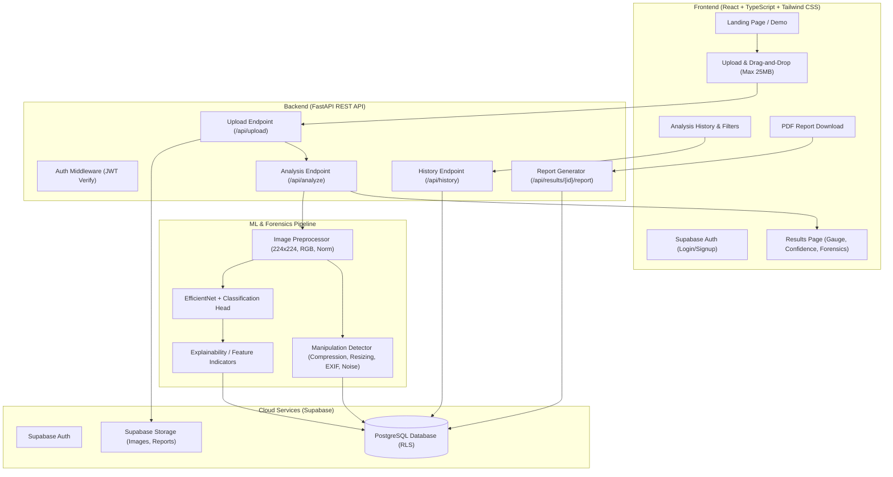

# ImageGuard: AI-Based Real vs AI-Generated Image Detection System

A modern, production-grade AI SaaS platform to detect and explain whether an image is authentic or AI-generated, featuring probability scoring, confidence metrics, image forensics/manipulation indicators, PDF reports, and analysis history.

---

## 1. System Architecture & Component Flow



---

## 2. Complete Project Directory Structure

```text
d:/Image detection/
│
├── data/                                 # Organized dataset directory
│   ├── raw/                              # Original untouched archives / downloads
│   ├── real/                             # Validated authentic images (JPG, PNG, WEBP)
│   ├── fake/                             # Validated AI-generated images (JPG, PNG, WEBP)
│   ├── corrupted_files.log               # Log of skipped corrupted/unreadable files
│   └── dataset_summary.json              # Class counts and metadata
│
├── scripts/                              # Utility & CLI tools
│   ├── organize_dataset.py               # Dataset classifier & organizer script
│   └── download_kaggle_dataset.py        # Optional Kaggle API fetcher
│
├── backend/                              # FastAPI Application
│   ├── app/
│   │   ├── main.py                       # FastAPI entrypoint, CORS, lifespan model loader
│   │   ├── api/
│   │   │   ├── dependencies.py           # Supabase auth token verification & DB clients
│   │   │   └── routes/
│   │   │       ├── health.py             # GET /api/health
│   │   │       ├── upload.py             # POST /api/upload
│   │   │       ├── analysis.py           # POST /api/analyze & GET /api/results/{id}
│   │   │       ├── history.py            # GET /api/history & DELETE /api/results/{id}
│   │   │       └── reports.py            # GET /api/results/{id}/report (PDF download)
│   │   ├── core/
│   │   │   ├── config.py                 # Pydantic Settings (.env loader)
│   │   │   └── security.py               # JWT parsing, auth validation
│   │   ├── schemas/
│   │   │   ├── upload.py                 # Upload request/response schemas
│   │   │   ├── analysis.py               # Prediction & confidence schemas
│   │   │   ├── history.py                # Query filters, pagination schemas
│   │   │   └── response.py               # Standardized API response format
│   │   ├── services/
│   │   │   ├── predictor_service.py      # Prepares tensor & runs EfficientNet inference
│   │   │   ├── forensics_service.py      # EXIF extraction, ELA / compression / noise analysis
│   │   │   ├── storage_service.py        # Supabase storage bucket upload/download
│   │   │   ├── supabase_service.py       # PostgreSQL queries via Supabase client
│   │   │   └── report_service.py         # ReportLab PDF generation
│   │   └── utils/
│   │       ├── validators.py             # File size, magic bytes, MIME & integrity checks
│   │       └── logger.py                 # Structured logging
│   ├── requirements.txt                  # Python dependencies
│   └── .env.example                      # Environment variables template
│
├── ml_pipeline/                          # Machine Learning Training & Forensics
│   ├── dataset.py                        # TF Data generator & split logic (70/15/15)
│   ├── preprocessing.py                  # Standardized 224x224 RGB normalization
│   ├── model_builder.py                  # EfficientNet transfer learning backbone + head
│   ├── train.py                          # Training loop with EarlyStopping, ReduceLROnPlateau
│   ├── evaluate.py                       # Accuracy, Precision, Recall, F1, AUC, Confusion Matrix
│   ├── manipulation_detector.py          # Standalone image forensic analyzer
│   └── explainability.py                 # Grad-CAM heatmap generation
│
├── models/                               # Exported ML model artifacts
│   ├── image_detection_v1.keras          # Trained Keras model
│   ├── model_metadata.json               # Architecture, parameters, evaluation metrics
│   └── checkpoints/                      # Best training epoch checkpoints
│
├── frontend/                             # React + TypeScript + Vite Frontend
│   ├── public/
│   │   ├── favicon.svg
│   │   └── samples/                      # Sample demo images (real and AI)
│   ├── src/
│   │   ├── components/
│   │   │   ├── ui/                       # shadcn/ui components (Button, Card, Dialog, Toast)
│   │   │   ├── Navbar.tsx                # Responsive header with theme toggle & user avatar
│   │   │   ├── Sidebar.tsx               # Dashboard navigation (Collapsible on mobile)
│   │   │   ├── UploadBox.tsx             # Drag-and-drop file upload zone
│   │   │   ├── ImagePreview.tsx          # Uploaded image thumbnail with remove/analyze controls
│   │   │   ├── ResultCard.tsx            # Real vs AI verdict card
│   │   │   ├── ProbabilityGauge.tsx      # Dual bar / donut visualization of probabilities
│   │   │   ├── ConfidenceMeter.tsx       # Low / Medium / High confidence indicator
│   │   │   ├── ForensicsPanel.tsx        # Compression, resizing, metadata, ELA display
│   │   │   ├── MetadataViewer.tsx        # EXIF camera, software, dimensions viewer
│   │   │   └── ProcessingSteps.tsx       # Stepwise subtle progress indicator
│   │   ├── pages/
│   │   │   ├── Landing.tsx               # Hero, interactive demo card, features, how-it-works
│   │   │   ├── Login.tsx                 # Supabase Email & OAuth login
│   │   │   ├── Signup.tsx                # Registration form
│   │   │   ├── Dashboard.tsx             # Quick stats, recent analyses, quick analyze CTA
│   │   │   ├── Analyze.tsx               # Main image analysis interface
│   │   │   ├── Results.tsx               # Full result breakdown, forensics, PDF export
│   │   │   ├── History.tsx               # Paginated, filterable, searchable history table
│   │   │   └── Settings.tsx              # Profile, appearance, theme switcher, privacy notice
│   │   ├── services/
│   │   │   ├── api.ts                    # Axios / Fetch client for FastAPI endpoints
│   │   │   └── supabase.ts               # Supabase JS client for Auth & Realtime
│   │   ├── hooks/
│   │   │   ├── useAuth.ts                # User session hook
│   │   │   └── useTheme.ts               # Dark / Light / System theme provider
│   │   ├── types/
│   │   │   └── index.ts                  # TypeScript interfaces for API & DB models
│   │   ├── App.tsx                       # React Router configuration
│   │   ├── main.tsx                      # Root mount & providers
│   │   └── index.css                     # Tailwind CSS tokens & base styles
│   ├── package.json
│   ├── tsconfig.json
│   ├── tailwind.config.js
│   └── vite.config.ts
│
├── supabase/                             # Database migrations & configuration
│   └── migrations/
│       └── 001_initial_schema.sql        # Tables, constraints, and Row Level Security (RLS)
│
└── tests/                                # Automated tests
    ├── test_validators.py
    ├── test_api_health.py
    ├── test_ml_pipeline.py
    └── test_forensics.py
```

---

## 3. Immediate First Action: Dataset Organization & Validation Script

The immediate requirement is to organize the dataset into `data/real/` and `data/fake/` without training any model or running ML inference.

### Script: `scripts/organize_dataset.py`

#### Requirements Implemented:
1. **Auto-Inspection**: Scans a designated source directory (or auto-locates raw dataset folders/zips). Detects labels from parent folder names, file path segments, or filename markers (e.g. `real`, `authentic`, `original` $\rightarrow$ `data/real/`; `fake`, `ai`, `synthetic`, `generated` $\rightarrow$ `data/fake/`).
2. **Deterministic Label Assignment**: Relies purely on ground-truth dataset labels; does **NOT** use any AI heuristic or guessing.
3. **Preserve Originals**: Copies files rather than moving or deleting them, leaving raw downloads intact.
4. **File Validation**:
   - Allowed extensions: `.jpg`, `.jpeg`, `.png`, `.webp` (case-insensitive).
   - Ignores non-image files (`.txt`, `.json`, `.csv`, `.DS_Store`, `.git`, etc.).
   - Verifies image integrity using PIL `Image.open()` + `img.verify()`.
5. **Corrupted File Handling**: Identifies corrupted, zero-byte, or truncated images, logs their paths to `data/corrupted_files.log`, and excludes them from the clean folders.
6. **Execution Output**:
   - Live progress indicator.
   - Total number of images classified as **REAL**.
   - Total number of images classified as **FAKE**.
   - Total number of corrupted/skipped files.
   - Final folder tree and disk usage summary.

---

## 4. Machine Learning Pipeline (Phase 2)

### 4.1 Architecture
- **Backbone**: EfficientNet (B0 or B7 depending on inference latency targets) pre-trained on ImageNet.
- **Classification Head**:
  - GlobalAveragePooling2D
  - BatchNormalization
  - Dense(256, activation='relu') + Dropout(0.5)
  - Dense(128, activation='relu') + Dropout(0.3)
  - Dense(1, activation='sigmoid')  *(0 = Real, 1 = AI-Generated)*
- **Resolution**: $224 \times 224 \times 3$, identical in training and inference.

### 4.2 Data Split & Augmentation
- Split: 70% Train, 15% Validation, 15% Hold-out Test (Test set is strictly isolated).
- Augmentation: Random horizontal flip, subtle rotation ($\pm 15^\circ$), zoom ($\pm 10\%$), shift ($\pm 10\%$).

### 4.3 Training Callbacks & Checkpoints
- `ModelCheckpoint` saving best model based on `val_auc` and `val_loss`.
- `EarlyStopping(patience=5, restore_best_weights=True)`.
- `ReduceLROnPlateau(factor=0.2, patience=2, min_lr=1e-6)`.

### 4.4 Image Forensics & Manipulation Detector (`ml_pipeline/manipulation_detector.py`)
- **Metadata Inspection**: Extraction of EXIF headers (camera model, software tags like Photoshop/Midjourney, creation dates).
- **Error Level Analysis (ELA)**: Computes compression artifact differentials to highlight altered segments.
- **Noise Analysis**: Estimates high-frequency noise variance across color channels to check synthetic smoothness.
- **Format & Resizing Metrics**: Aspect ratio anomalies and interpolation artifacts.

---

## 5. Supabase Database Schema

```sql
-- Enable UUID extension
CREATE EXTENSION IF NOT EXISTS "uuid-ossp";

-- Profiles table (synced with Supabase Auth)
CREATE TABLE profiles (
    id UUID PRIMARY KEY REFERENCES auth.users(id) ON DELETE CASCADE,
    email TEXT UNIQUE NOT NULL,
    full_name TEXT,
    avatar_url TEXT,
    created_at TIMESTAMPTZ DEFAULT NOW(),
    updated_at TIMESTAMPTZ DEFAULT NOW()
);

-- Uploads table
CREATE TABLE uploads (
    id UUID PRIMARY KEY DEFAULT uuid_generate_v4(),
    user_id UUID REFERENCES profiles(id) ON DELETE CASCADE,
    filename TEXT NOT NULL,
    storage_path TEXT NOT NULL,
    file_size BIGINT NOT NULL,
    mime_type TEXT NOT NULL,
    status TEXT DEFAULT 'uploaded' CHECK (status IN ('uploaded', 'processing', 'completed', 'failed')),
    created_at TIMESTAMPTZ DEFAULT NOW()
);

-- Analysis results table
CREATE TABLE analysis_results (
    id UUID PRIMARY KEY DEFAULT uuid_generate_v4(),
    upload_id UUID REFERENCES uploads(id) ON DELETE CASCADE,
    user_id UUID REFERENCES profiles(id) ON DELETE CASCADE,
    classification TEXT NOT NULL CHECK (classification IN ('real', 'ai_generated', 'needs_review')),
    ai_probability NUMERIC(5, 2) NOT NULL,
    real_probability NUMERIC(5, 2) NOT NULL,
    confidence TEXT NOT NULL CHECK (confidence IN ('high', 'medium', 'low')),
    processing_time_ms INTEGER NOT NULL,
    model_version TEXT NOT NULL,
    created_at TIMESTAMPTZ DEFAULT NOW()
);

-- Manipulation & Forensics details table
CREATE TABLE manipulation_details (
    id UUID PRIMARY KEY DEFAULT uuid_generate_v4(),
    analysis_id UUID REFERENCES analysis_results(id) ON DELETE CASCADE,
    compression_status TEXT NOT NULL,
    resize_status TEXT NOT NULL,
    filter_status TEXT NOT NULL,
    metadata_status TEXT NOT NULL,
    details JSONB NOT NULL DEFAULT '{}'::jsonb,
    created_at TIMESTAMPTZ DEFAULT NOW()
);

-- Row Level Security (RLS)
ALTER TABLE profiles ENABLE ROW LEVEL SECURITY;
ALTER TABLE uploads ENABLE ROW LEVEL SECURITY;
ALTER TABLE analysis_results ENABLE ROW LEVEL SECURITY;
ALTER TABLE manipulation_details ENABLE ROW LEVEL SECURITY;

CREATE POLICY "Users can manage own profile" ON profiles FOR ALL USING (auth.uid() = id);
CREATE POLICY "Users can view and manage own uploads" ON uploads FOR ALL USING (auth.uid() = user_id);
CREATE POLICY "Users can view and manage own results" ON analysis_results FOR ALL USING (auth.uid() = user_id);
CREATE POLICY "Users can view own manipulation details" ON manipulation_details FOR ALL USING (
    EXISTS (SELECT 1 FROM analysis_results WHERE analysis_results.id = manipulation_details.analysis_id AND analysis_results.user_id = auth.uid())
);
```

---

## 6. Frontend SaaS Interface Plan

### Visual Style
- **Aesthetic**: Minimal, clean, high-precision dark/light mode inspired by Linear and Vercel.
- **Color Palette**:
  - Light: `#FFFFFF` (bg), `#F8FAFC` (subtle bg), `#0F172A` (text), `#E2E8F0` (borders), `#2563EB` / `#4F46E5` (accents).
  - Dark: `#09090B` (bg), `#111113` (cards), `#FAFAFA` (text), `#27272A` (borders), `#3B82F6` (accents).
- **Core Screens**:
  1. **Landing Page**: Hero banner with live interactive mock card, "How it works" 4-step cards, sample images selector, feature grid.
  2. **Analyze Page**: Drag-and-drop dropzone, live image thumbnail preview with file metadata, "Analyze" button, staged loading progress animation.
  3. **Results Page**: Verdict banner (`AI-Generated` / `Real` / `Needs Review`), percentage dials, confidence badge, forensic analysis panel, EXIF drawer, "Download PDF" and "Analyze Another" actions.
  4. **History Page**: Searchable table, filter pills (`All`, `Real`, `AI-Generated`), date sorting, row deletion with toast confirmation.
  5. **Settings Page**: Profile details, theme switcher (Light/Dark/System), privacy policy declaration.

---

## 7. Verification & Testing Plan

### 1. Dataset Organization Verification
- Run `python scripts/organize_dataset.py --source <source_path>`.
- Verify `data/real/` and `data/fake/` contain only readable images with valid extensions.
- Verify `data/corrupted_files.log` records any damaged files without halting execution.
- Check summary printout against file system counts.

### 2. Backend Unit & Integration Tests
- `pytest tests/test_validators.py`: Test MIME type, size limit (25MB), file signature checking.
- `pytest tests/test_api_health.py`: Test `/api/health` response and model loaded state.
- `pytest tests/test_forensics.py`: Validate EXIF extraction and ELA calculations on dummy images.

### 3. Frontend & End-to-End Tests
- Validate drag-and-drop interactions, file format rejection toasts, and image preview rendering.
- Verify JWT auth handling and Supabase session state persistence across page refreshes.
- Test PDF generation and verify formatting of the downloaded ReportLab file.

---

## 8. Open Questions & Setup Guidance

> [!IMPORTANT]
> **Dataset Source Location**:
> The workspace currently contains only the project abstract PDF. Please confirm if you have already downloaded the Kaggle dataset (`shivamardeshna/real-and-fake-images-dataset-for-image-forensics`) archive to your machine (and its path, e.g. in your Downloads or an external drive), or if you would like the script to download it via Kaggle CLI / allow you to place it into `data/raw/`.
